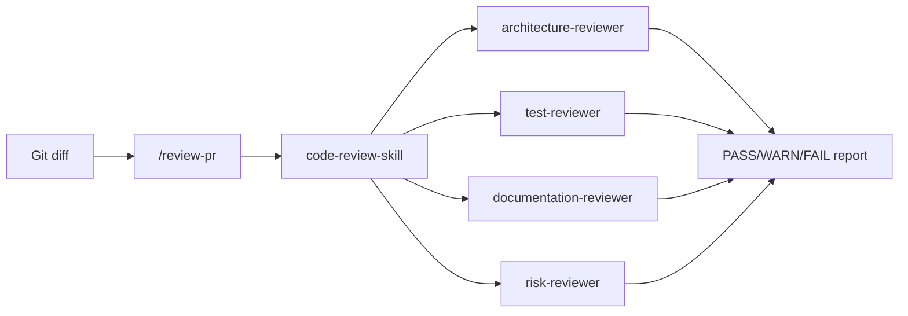

# Smart Code Review Guardian

AI-native **Claude Code plugin** for reviewing pull requests and local git changes before merge. Produces structured **PASS / WARN / FAIL** reports with actionable findings.

Detects missing tests, architecture violations, documentation gaps, security risks, and common AI-generated code smells.

---

## Features

- **5 slash commands** — full review or focused checks (tests, architecture, docs, evals)
- **4 specialized subagents** — architecture, test, documentation, and risk reviewers
- **Diff-first review** — staged → working tree → branch vs `main`/`master`
- **Eval harness** — 5 golden cases, runnable locally with `npm run verify`
- **Hooks & scripts** — git context collection, report validation, optional pre-commit gates

---

## Quick start

**Requirements:** [Claude Code](https://code.claude.com), Node.js 18+, Git

```bash
git clone https://github.com/ParisaJamadi/Smart-Code-Review-Guardian.git
cd Smart-Code-Review-Guardian
claude --plugin-dir .
```

In Claude Code:

```
/smart-code-review-guardian:review-pr
```

Stage changes first (`git add <files>`). Verify the harness without AI:

```bash
npm run verify
```

**Step-by-step testing (Windows-friendly):** [QUICKSTART.md](QUICKSTART.md)

---

## Commands

| Command | Purpose |
| --- | --- |
| `/smart-code-review-guardian:review-pr` | Full review → structured report |
| `/smart-code-review-guardian:review-architecture` | Layer violations and pattern checks |
| `/smart-code-review-guardian:check-tests` | Missing or weak test coverage |
| `/smart-code-review-guardian:check-docs` | README / docs out of sync |
| `/smart-code-review-guardian:run-review-evals` | Run golden-case eval harness |

Details: [docs/commands.md](docs/commands.md) · Skills: [docs/skills.md](docs/skills.md) · Subagents: [docs/agents.md](docs/agents.md)

---

## How it works



1. `collect-git-context.js` gathers the diff as JSON
2. `/review-pr` orchestrates specialized reviewers in parallel
3. Findings merge into a fixed markdown report (see [examples/sample-review-output.md](examples/sample-review-output.md))
4. Scoring follows [REVIEW_POLICY.md](REVIEW_POLICY.md)

---

## Project structure

```
Smart-Code-Review-Guardian/
├── .claude-plugin/plugin.json   # Plugin manifest
├── commands/                    # Slash commands
├── skills/                      # Reusable review workflows
├── agents/                      # Subagent definitions
├── hooks/                       # Session + optional git hooks
├── scripts/                     # Git context + report validation
├── evals/                       # Golden cases + run-evals.js
├── demo-app/                    # Sandbox for review scenarios
├── docs/                        # Command, skill, and agent reference
└── examples/                    # Demo walkthroughs + sample output
```

---

## Try the demo scenarios

Use `demo-app/` to practice PASS / WARN / FAIL outcomes:

| Scenario | Change | Expected |
| --- | --- | --- |
| Docs only | Edit `demo-app/README.md` | PASS |
| Missing tests | Add `demo-app/src/billing/discount.js` | WARN / FAIL |
| Architecture | Controller imports DB directly | WARN |
| Doc gap | New CLI flag, no README update | WARN |
| Secret | Hardcoded API key in config | FAIL |

Walkthrough: [examples/scenario-demo-walkthrough.md](examples/scenario-demo-walkthrough.md)

---

## Documentation

| Topic | Link |
| --- | --- |
| Quick start & testing | [QUICKSTART.md](QUICKSTART.md) |
| Review scoring & guardrails | [REVIEW_POLICY.md](REVIEW_POLICY.md) |
| Demo scripts | [examples/demo-walkthrough.md](examples/demo-walkthrough.md) |
| Eval harness | [evals/README.md](evals/README.md) |
| Git hooks | [hooks/README.md](hooks/README.md) |
| Design notes | [REFLECTION.md](REFLECTION.md) |

---

## Limitations

- Evals validate reference outputs — not every live LLM response
- Hooks use regex heuristics; full review requires `/review-pr`
- MCP server is a stub (no GitHub/CI credentials)
- Bash hooks need Git Bash or WSL on Windows

---

## License

MIT — see [LICENSE](LICENSE)
