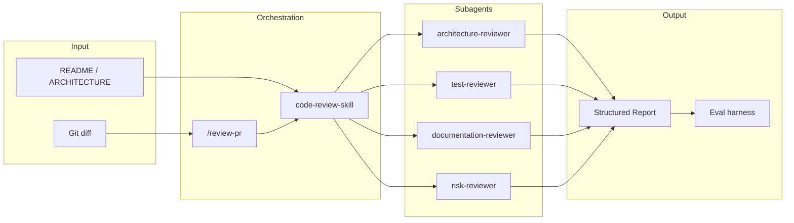

# Smart Code Review Guardian

AI-native Claude Code plugin for reviewing Pull Requests and local changes before merge. Detects missing tests, architecture violations, documentation gaps, risky changes, and common AI-generated code smells.

## Problem statement

Manual code review is slow, inconsistent, and easy to skip under deadline pressure. Generic AI chat reviews often hallucinate files, miss repo-specific conventions, and produce unstructured feedback that is hard to act on. Teams need a **reusable review harness** that integrates with developer workflows, limits context intelligently, and can be evaluated over time.

## Why this plugin exists

Smart Code Review Guardian packages code review as a **production-grade Claude Code plugin** — not a one-off prompt. It combines commands, skills, subagents, hooks, and a lightweight eval pipeline so teams can gate merges with consistent PASS/WARN/FAIL decisions and actionable findings.

## Who is the user?

- **Individual developers** reviewing local changes or draft PRs before opening review
- **Tech leads** enforcing architecture and test standards via shared skills
- **Platform / DevEx teams** distributing review workflows across repositories via plugin marketplaces
- **CI owners** wiring strict hooks and eval scripts into pipelines

## Installation

### Local development (recommended for demo)

```bash
cd smart-code-review-guardian
claude --plugin-dir .
```

Or clone this repository and pass its path to `--plugin-dir`.

### Claude Code plugin manager

When published to a marketplace, install via the plugin manager:

```
/plugin install smart-code-review-guardian
/reload-plugins
```

### Requirements

- Claude Code (latest)
- Node.js 18+ (scripts, evals, MCP stub)
- Git (diff collection)
- Bash for hooks (Git Bash / WSL on Windows)

## Commands

| Command | Purpose |
| --- | --- |
| `/smart-code-review-guardian:review-pr` | Full structured review of staged, working-tree, or branch diff |
| `/smart-code-review-guardian:review-architecture` | Layer violations and pattern checks |
| `/smart-code-review-guardian:check-tests` | Test coverage and missing regression tests |
| `/smart-code-review-guardian:check-docs` | README/docs sync with API/CLI/config changes |
| `/smart-code-review-guardian:run-review-evals` | Run local golden-case eval harness |

Full command reference: [commands/README.md](commands/README.md)

Skills are also model-invoked when context matches (e.g. `code-review-skill`). See [skills/README.md](skills/README.md).

## Example usage

```bash
# 1. Stage your changes
git add -A

# 2. Optional: collect context
node scripts/collect-git-context.js

# 3. In Claude Code
/smart-code-review-guardian:review-pr

# 4. Run evals and verify harness
npm run verify
# Or: node evals/run-evals.js
```

See [examples/demo-walkthrough.md](examples/demo-walkthrough.md) and [examples/sample-review-output.md](examples/sample-review-output.md).

## Architecture

```
smart-code-review-guardian/
├── .claude-plugin/plugin.json   # Manifest (Claude Code convention)
├── commands/                    # Slash commands (/review-pr, etc.)
├── skills/                      # Reusable agent skills
├── agents/                      # Specialised subagents
├── hooks/                       # Pre-commit / pre-push scripts + hooks.json
├── scripts/                     # Git context + report validation
├── evals/                       # Golden cases + run-evals.js
├── mcp/                         # Optional MCP stub (no credentials)
├── REVIEW_POLICY.md             # Scoring and guardrails
└── examples/                    # Sample output + demo script
```



## Core components implemented

| Component | Location | Status |
| --- | --- | --- |
| Custom commands | `commands/*.md` | ✅ 5 commands |
| Skills | `skills/*/SKILL.md` | ✅ 4 skills |
| Subagents | `agents/*.md` | ✅ 4 agents |
| Hooks | `hooks/pre-commit-review.sh`, `pre-push-review.sh`, `hooks.json` | ✅ |
| Evaluations | `evals/` | ✅ 5 golden cases |
| MCP stub | `mcp/review-context-stub.js`, `.mcp.json` | ✅ Optional |
| Scripts | `scripts/collect-git-context.js`, `validate-review-output.js` | ✅ |

## Context engineering decisions

1. **Diff-first** — Review changed files only; expand to README/ARCHITECTURE/tests on demand
2. **Diff source priority** — Staged → working tree → branch vs main/master (documented in REVIEW_POLICY.md)
3. **Bounded reads** — Skills explicitly forbid full-repo scans
4. **Missing Context section** — Surfaces uncertainty instead of guessing
5. **Subagent specialisation** — Parallel focused reviewers merge into one report
6. **Helper script** — `collect-git-context.js` normalises git state as JSON for agents

## Guardrails

- Never assume files exist without checking
- Never claim tests exist unless found
- Never invent team standards without repo docs (label inferences)
- No destructive git commands or automatic package installs
- Redact secrets in output
- PASS/WARN/FAIL rules in REVIEW_POLICY.md

## Evaluation approach

- **Golden cases** in `evals/golden-cases.json` cover missing tests, architecture, docs, false positives, secrets
- **expected-results.json** defines keyword/category/severity rules
- **Sample outputs** in `evals/samples/` stand in for LLM responses
- **run-evals.js** validates harness behaviour locally and in CI (`--strict`)

Run: `npm run verify` or `node evals/run-evals.js` (exits non-zero if any case fails)

## Demo walkthrough

See [examples/demo-walkthrough.md](examples/demo-walkthrough.md) for a live 5-minute demo and [examples/scenario-demo-walkthrough.md](examples/scenario-demo-walkthrough.md) for three PR scenarios (missing tests, architecture violation, doc gap + secret).

## Limitations

- Live LLM quality is not fully automated — evals validate reference outputs, not every model response
- Hooks use regex heuristics — not a substitute for full `/review-pr`
- Architecture rules inferred when `ARCHITECTURE.md` is absent
- MCP stub does not connect to GitHub/CI without additional implementation
- Bash hooks require Git Bash/WSL on Windows

## Future improvements

- GitHub PR integration via MCP (checks, comments, required status)
- LLM-as-judge eval layer on real PR diffs
- Team-specific policy packs (override REVIEW_POLICY.md)
- IDE status bar integration for review score
- Caching of repo context across sessions

## Scaling to multiple teams

1. **Fork policy** — Each team maintains `REVIEW_POLICY.md` overrides or a `policy/` directory
2. **Marketplace distribution** — Pin plugin version per org
3. **Strict CI mode** — `SMART_REVIEW_STRICT=true` on protected branches
4. **Metrics** — Track WARN/FAIL rates, time-to-fix findings, false positive reports
5. **Eval expansion** — Team-specific golden cases from historical PRs

## Assumptions (Claude Code conventions)

- Plugin manifest lives at `.claude-plugin/plugin.json` per [Claude Code plugin docs](https://code.claude.com/docs/en/plugins)
- Commands are namespaced: `/smart-code-review-guardian:review-pr`
- `${CLAUDE_PLUGIN_ROOT}` resolves to plugin directory when loaded via `--plugin-dir`
- User-requested root `plugin.json` is replaced by `.claude-plugin/plugin.json` for compatibility

## Related docs

- [SUBMISSION_CHECKLIST.md](SUBMISSION_CHECKLIST.md) — Requirement-to-file mapping
- [commands/README.md](commands/README.md) — Command reference
- [skills/README.md](skills/README.md) — Reusable skill workflows
- [agents/README.md](agents/README.md) — Subagent scope and pairing
- [hooks/README.md](hooks/README.md) — Non-intrusive hook design
- [REVIEW_POLICY.md](REVIEW_POLICY.md) — Scoring rubric
- [AI_PROMPTS.md](AI_PROMPTS.md) — Prompt log used to build this plugin
- [REFLECTION.md](REFLECTION.md) — Design trade-offs and post-release feedback plan
- [evals/README.md](evals/README.md) — Eval harness details

## License

MIT
# test

